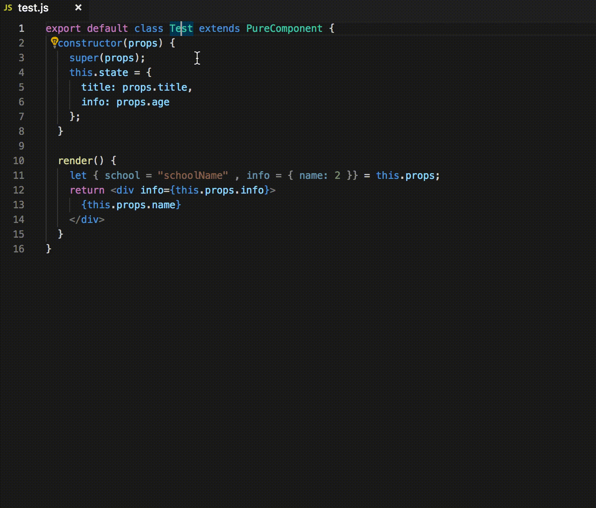

# react-proptypes-generate [](https://badge.fury.io/js/react-proptypes-generate)
  This is the VS Code's extension that automatically generates PropTypes code for React components, like [ReactPropTypes](https://github.com/dpzxsm/ReactPropTypes-Plugin) in the Jetbrains's Platform.
  Also a command line tool, you don’t have to be limited to use in vscode. If you want fully automatic PropTypes generation, You can also use with lint-staged in your project.

## Installation
### VS Code
  Search react-proptypes-generate in Marketplace and install it.

### Command Line
If you want to use it directly on the command line, you can install cli by npm install.
```
npm install react-proptypes-generate -g
```

### Project with lint-staged
```
    npm install --save-dev react-proptypes-generate lint-staged husky
    or
    yarn add react-proptypes-generate lint-staged husky -D
```

## Usage
### VS Code
1. Select your Component's name
2. Press <kbd>command</kbd> + <kbd>.</kbd> (Windows is <kbd>Ctrl</kbd> + <kbd>.</kbd>) show Code Actions and select PropTypesGenerate, or press <kbd>shift</kbd> + <kbd>command</kbd> + <kbd>alt</kbd> + <kbd>P</kbd> (Windows is <kbd>shift</kbd> + <kbd>ctrl</kbd> + <kbd>alt</kbd> + <kbd>P</kbd>) in the macOS
3. Input propType to replace default type



### Command Line
1. `rpg-cli -h` show Help
2. `rpg-cli <JsFilePath> <ComponentName>` to generate `PropTypes`
3. `rpg-cli config <JsonFilePath>` to config generated `Settings`
4. `rpg-cli project <DirPath>` to batch generated `PropTypes` for Project
5. `rpg-cli fix <files...>` to batch generated `PropTypes` for many files

If you want ian to always use the latest version, you can use npx to instead of `rpg-cli`, like：
```
npx react-proptypes-generate -h
npx react-proptypes-generate ./examples/index.jsx Test
npx react-proptypes-generate setting.json
npx react-proptypes-generate project ./examples/
npx react-proptypes-generate fix index.jsx index2.jsx src/index3.js
```

If you want to every project have different config, you can create a json file named `rpg.config.json` and put it in root folder.
`rpg.config.json` examples:
```json5
{
  "autoImport": "ES6",
  "codeStyle": "default",
  "noMergeOld": false,
  "mergeOldIfExist": true,
  "noShape": false,
  "tabWidth": 2,
  "quote": "double",
  "trailingComma": false,
  "semicolon": true,
  "arrayLike": true,
  "isRequired": false,
  "include": [
    "src/**/*"  // support glob
  ],
  "exclude": [
    "node_modules"
  ]
}
```

### Project with lint-staged
edit package.json file

#### Config Git precommit hooks
```json
{
  "husky": {
    "hooks": {
      "pre-commit": "npm run lint-staged"
    }
  }
}
```

#### Config lint-staged, like: 
```json
{
    "lint-staged": {
        "**/*.{js,jsx,ts,tsx}": [
          "rpg-cli fix"
        ]
    }
}
```

### TypeScript Need to Know
Because of the ast parser is `flow-parser`, so TypeScript sometimes generates strange types.
####  Already known Case
+ use `as` in the props's ES6 destruct, will generate redundant error types, like: 
 ```javascript
   let { age = 0 as number, students = [] } = props;
   // will generated
   Test.propTypes = {
      number: PropTypes.any,
      age: PropTypes.number,
      students: PropTypes.array
   }
 ```
+ Not Support convert Typescript’s type to PropType, like:
```typescript
    let age:number = props.age
    // will generated
    Test.propTypes = {
       age: PropTypes.any,
    }
```

## Examples case
```jsx harmony
import React from 'react'
function Test(props) {
  let { school: schoolAlias = "schoolName", info = { name: 2 }, year = 33 , onClick } = props;
  return <div onClick={() => onClick()} />
}
//will generate 
Test.propTypes = {
  info: PropTypes.shape({
    name: PropTypes.number
  }),
  onClick: PropTypes.func,
  school: PropTypes.string,
  year: PropTypes.number
} 
```

## Special case
To prevent the `array` type may be prejudged to `shape` type, you should set a default value.
```jsx harmony
import React from 'react'
function Test(props) {
  let { students = [] } = props;
  let length = students.length;
  return <div/>
}
//will generate 
Test.propTypes = {
  students: PropTypes.array
} 
```

## Keep PropTypes's Comments
If you want to keep PropTypes's comments, you must put the comments in the every PropTypes's end, like:
```javascript
Test.propTypes = {
  students: PropTypes.array, // students
  teacher: PropTypes.shape({
     name: PropTypes.string, // teacher 's name
  }) // teacher
} 
```

## Extension Settings

This extension contributes the following settings:

* `propTypes.autoImport`: Auto import or require PropTypes module(disabled|commonJS|ES6)
* `propTypes.codeStyle`: PropTypes Generate Style(default|class)
* `propTypes.tabWidth`: Number of spaces the pretty-printer should use per tab for indentation (number)
* `propTypes.quote`: Override the quotes used in string literals(single|double|auto|null)
* `propTypes.trailingComma`: Controls the printing of trailing commas in object literals, array expressions and function parameters(boolean)
* `propTypes.semicolon`: If true, there will be a semicolon after PropType statement
* `propTypes.afterFormat`: If true, after generate propTypes, trigger vscode's formatting for PropTypes(boolean)
* `propTypes.noMergeOld`: Defaults is merge old PropTypes, if true, will generate new PropTypes(boolean)
* `propTypes.mergeOldIfExist`: If true, old PropTypes different with new PropTypes will be deleted, only used when `noMergeOld` is false(boolean)
* `propTypes.noShape`: Defaults is generate shape type, if true, will generate object type(boolean)
* `propTypes.arrayLike`: If true, some shape type which is similar to Array will be set array type instead(boolean)
* `isRequired`: If true, all PropTypes is will be set to isRequired(boolean)

## Command Line Settings

Command Line can config the following settings:

* `autoImport`: Auto import or require PropTypes module(disabled|commonJS|ES6)
* `codeStyle`: PropTypes Generate Style(default|class)
* `tabWidth`: Number of spaces the pretty-printer should use per tab for indentation (number)
* `quote`: Override the quotes used in string literals(single|double|auto|null)
* `trailingComma`: Controls the printing of trailing commas in object literals, array expressions and function parameters(boolean)
* `semicolon`: If true, there will be a semicolon after PropType statement
* `noMergeOld`: Defaults is merge old PropTypes, if true, will generate new PropTypes(boolean)
* `mergeOldIfExist`: If true, old PropTypes different with new PropTypes will be deleted, only used when `noMergeOld` is false(boolean)
* `noShape`: Defaults is generate shape type, if true, will generate object type(boolean)
* `arrayLike`: If true, some shape type which is similar to Array will be set array type instead(boolean)
* `isRequired`: If true, all PropTypes is will be set to isRequired(boolean)
* `include`: Match need generated files, only used in `fix` and `project`(array)
* `exclude`: Match node need generated files, only used in `fix` and `project`(array)

## CHANGELOG

[Look it](./CHANGELOG.md) 

